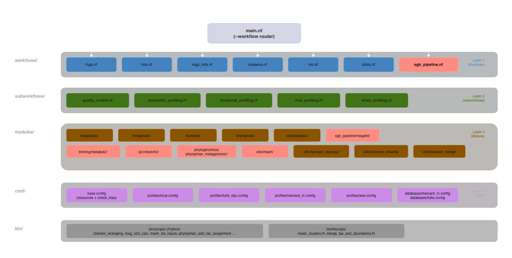
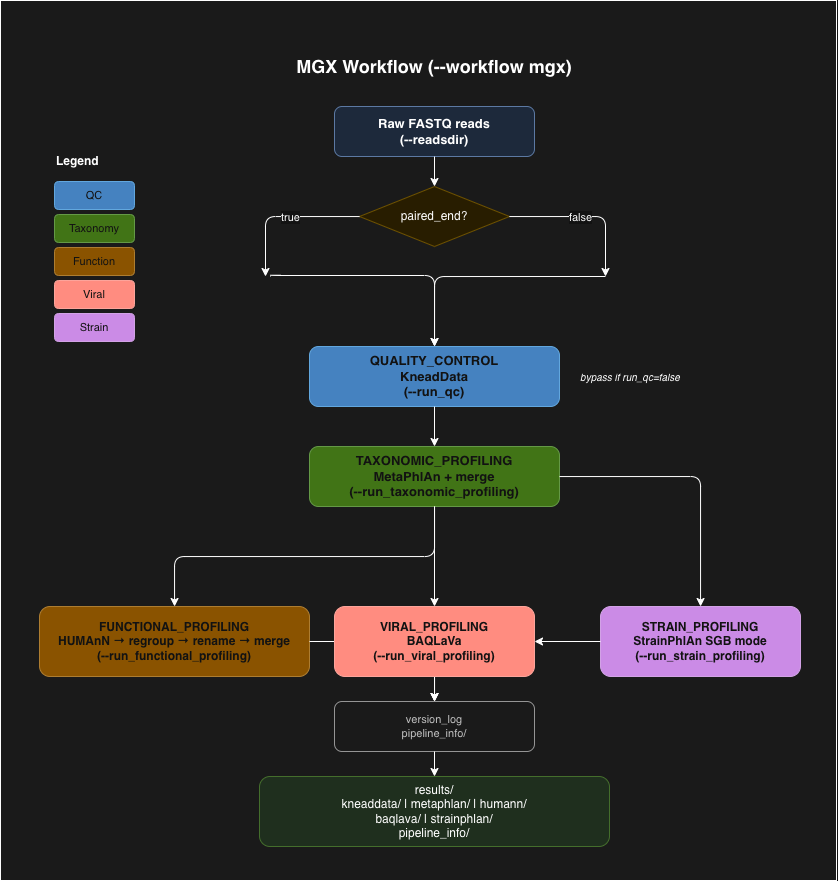

# biobakery-nextflow — Architecture & Migration Reference

> **Pipeline version:** 0.0.1  
> **Nextflow version:** 24.10.4 (requires Java 11+)  
> **Status:** Active development — MGX, MTX, MGX+MTX, SGB pipeline, vis and stats complete; 16S pending

---

## 1. Implementation Status

### Completed

| Component | Details |
|---|---|
| Multi-workflow router | `main.nf` routes via `--workflow mgx\|mtx\|mgx_mtx\|16s\|vis\|stats\|assembly` |
| nf-core-style module layout | `modules/` → `subworkflows/` → `workflows/` layering |
| MGX workflow | KneadData → MetaPhlAn → HUMAnN → regroup/rename/merge → BAQLaVa (opt) → StrainPhlAn (opt) |
| SGB pipeline workflow | KneadData → MEGAHIT → Bowtie2+depth → MetaBAT2 → CheckM2 → PhyloPhlAn → Mash → SGB clustering |
| Feature flag toggles | `run_qc`, `run_taxonomic_profiling`, `run_functional_profiling`, `run_viral_profiling`, `run_strain_profiling` |
| HUMAnN post-processing | `humann_regroup`, `humann_rename`, `humann_merge` — all implemented |
| StrainPhlAn subworkflow | `sample2markers` → `strainphlan` per clade; SGB mode |
| BAQLaVa viral profiling | `subworkflows/viral_profiling.nf`; `--run_viral_profiling` |
| MetaPhlAn version abstraction | `metaphlan_v3` / `metaphlan_v4` / `metaphlan_4.0.6_fixed` CLI flag styles |
| HUMAnN 3/4 compatibility | `--utility-database` conditional; v37 vs v4a output renaming |
| Version logging | `modules/utils/version_log/main.nf` → `results/pipeline_info/versions.txt` + `db_paths.txt` |
| Harvard FASRC (HSPH) profile | `hsph` SLURM partition, hutlab module integration, DB paths in `conf/databases/harvard_rc.config` |
| Tufts HPC profile | Apptainer/SLURM, DB paths in `conf/databases/tufts.config` |
| AWS Batch profile | Per-process ECR containers, S3 I/O |
| Execution reports | Timeline, report, trace, DAG — all timestamped to `results/pipeline_info/` |
| Architecture diagrams | draw.io source files in `assets/diagrams/` |
| Demo test sample | `test/single_end_rawfastq/HD32R1_subsample.fastq.gz` |
| CI tests (nf-test) | `tests/main.nf.test`, `tests/validate_output.nf.test` |

---

## 2. Project Structure

```
biobakery-nextflow/
├── main.nf                              # Entry point — workflow router (--workflow flag)
├── nextflow.config                      # Global params + profile imports
├── template-params.yaml                 # Reference params for all environments
├── Dockerfile                           # Combined kneaddata+metaphlan+humann image
├── nf-test.config                       # nf-test configuration
│
├── workflows/                           # Top-level workflow entry points
│   ├── mgx.nf                           # Whole metagenome shotgun ✅
│   ├── assembly.nf                  # MAG assembly → SGB clustering ✅
│   ├── mgx_mtx.nf                       # MGX + MTX joint, RNA/DNA ratio ✅
│   ├── mtx.nf                           # Metatranscriptome ✅
│   ├── sixteens.nf                      # 16S amplicon 🔜
│   ├── vis.nf                           # Quarto report generation 🔜
│   └── stats.nf                         # Statistical analysis 🔜
│
├── subworkflows/                        # Reusable multi-step subworkflows
│   ├── quality_control.nf               # KneadData (paired + single-end routing)
│   ├── taxonomic_profiling.nf           # MetaPhlAn + bzip + merge
│   ├── functional_profiling.nf          # HUMAnN + regroup + rename + merge
│   ├── viral_profiling.nf               # BAQLaVa (expandable — see §5)
│   └── strain_profiling.nf              # sample2markers → strainphlan per clade
│
├── modules/                             # nf-core-style single-tool modules
│   ├── kneaddata/main.nf                # single_end_kneaddata, paired_end_kneaddata
│   ├── metaphlan/main.nf                # metaphlan, metaphlan_bzip, metaphlan_merge
│   ├── humann/main.nf                   # humann
│   ├── strainphlan/main.nf              # sample2markers, strainphlan
│   ├── viral/
│   │   └── baqlava/main.nf              # baqlava
│   ├── assembly/
│   │   └── megahit/main.nf              # megahit de novo assembly
│   ├── binning/
│   │   └── metabat2/main.nf             # metabat2
│   ├── qc/
│   │   └── checkm2/main.nf             # checkm2, checkm2_merge, mag_n50, checkm2_wrangling
│   ├── phylogenomics/
│   │   └── phylophlan_metagenomic/main.nf  # phylophlan_metagenomic, phylophlan_merge
│   └── utils/
│       ├── align_and_depth/main.nf      # Bowtie2 + jgi_summarize_bam_contig_depths
│       ├── mash/main.nf                 # mash_list_inputs/sketch/paste/dist, sgb_cluster, merge_tax_abundance
│       ├── humann_regroup/main.nf
│       ├── humann_rename/main.nf
│       ├── humann_merge/main.nf
│       └── version_log/main.nf          # Tool + DB version capture → pipeline_info/
│
├── conf/
│   ├── base.config                      # Default resources + check_max() closure
│   ├── profiles/
│   │   ├── harvard_rc.config            # SLURM hsph, hutlab beforeScript per process
│   │   ├── tufts_hpc.config             # SLURM batch, Apptainer bind
│   │   ├── aws.config                   # AWS Batch, ECR containers
│   │   └── local.config                 # Local execution
│   └── databases/
│       ├── harvard_rc.config            # DB paths for Harvard FASRC (auto-loaded by -profile harvard_rc)
│       └── tufts.config                 # DB paths for Tufts HPC (auto-loaded by -profile tufts_hpc)
│
├── bin/
│   ├── scripts/                         # Python helpers (SGB pipeline)
│   │   ├── checkm_wrangling.py
│   │   ├── mag_n50_calc.py
│   │   ├── mash_list_inputs.py
│   │   ├── phylophlan_add_tax_assignment.py
│   │   └── ...
│   └── Rscripts/                        # R helpers (SGB pipeline)
│       ├── mash_clusters.R
│       └── merge_tax_and_abundance.R
│
├── assets/
│   └── diagrams/                        # draw.io source files
│       ├── architecture_overview.drawio
│       ├── mgx_workflow.drawio
│       ├── assembly.drawio
│       ├── mtx_workflow.drawio
│       ├── mgx_mtx_workflow.drawio
│       └── sixteens_workflow.drawio
│
├── test/
│   ├── rawfastq/                        # Paired-end test reads
│   ├── single_end_rawfastq/             # Single-end test reads (incl. HD32R1 demo)
│   └── tutorial_output/                 # Validated reference outputs
│
├── tests/                               # nf-test suite
│   ├── main.nf.test
│   ├── validate_output.nf.test
│   └── nextflow.config
│
└── processes/                           # Legacy flat structure (reference only — not used by main.nf)
    ├── kneaddata.nf
    ├── metaphlan.nf
    ├── humann.nf
    └── baqlava.nf
```



---

## 3. Anadama2 → Nextflow Feature Mapping

### Core Task Orchestration

| Anadama2 | Nextflow | Status | Notes |
|---|---|---|---|
| `workflow.add_task()` | `process { }` | ✅ | All MGX + SGB processes converted |
| `workflow.add_task_gridable()` | `process { executor 'slurm' }` | ✅ | Via `harvard_rc`, `tufts_hpc` profiles |
| `workflow.add_task_group()` | Process with channel `.each` | ✅ | Channel-based per-sample parallelism |
| `workflow.add_task_group_gridable()` | Process + SLURM executor | ✅ | Automatic via profile |
| `workflow.add_document()` | Quarto process | 🔜 P2 | Visualization workflow stub |
| `-resume` / skip completed | `-resume` flag | ✅ | Built-in Nextflow caching |
| `--local-jobs N` | Channel-based parallelism | ✅ | Automatic; `queueSize` for limits |
| `--grid-jobs N` | `process.maxForks` / `queueSize` | ✅ | Per-profile or command-line |

### Dependencies and I/O

| Anadama2 | Nextflow | Status | Notes |
|---|---|---|---|
| `depends=[files]` | `input: path(files)` | ✅ | |
| `targets=[files]` | `output: path(files)` | ✅ | |
| `TrackedExecutable("tool")` | `container` / `beforeScript` module load | ✅ | hutlab module-based on Harvard RC |
| `[depends[0]]` template | `${input_file}` | ✅ | |
| `[targets[0]]` template | Named `emit:` output variables | ✅ | |
| `file_size('[depends[0]]')` | `input_file.size()` in closure | 🔜 P3 | Dynamic resource allocation |

### Resource Management

| Anadama2 | Nextflow | Status | Notes |
|---|---|---|---|
| `time=equation` | `time { check_max(N.h * task.attempt, 'time') }` | ✅ | All processes use `check_max()` retry scaling |
| `mem=equation` | `memory { check_max(N.GB * task.attempt, 'memory') }` | ✅ | |
| `cores=N` | `cpus N` | ✅ | Per-process, per-profile |
| Dynamic retry scaling | `memory * task.attempt` | ✅ | In all processes via `base.config` |
| File-size-based scaling | `input.size()` closures | 🔜 P3 | Static values used currently |

### CLI and Configuration

| Anadama2 | Nextflow | Status | Notes |
|---|---|---|---|
| `workflow.parse_args()` | `params.*` + `-params-file` | ✅ | |
| `--input` | `--readsdir` + `--filepattern` | ✅ | |
| `--output` | `--outdir` | ✅ | |
| `--contaminate-databases` | `--host_genome` | ✅ | |
| `--threads` | `process.cpus` | ✅ | Per-process in `conf/base.config` |
| `--grid` / `--grid-partition` | `-profile` / `queue` | ✅ | |
| `--bypass-quality-control` | `--run_qc false` | ✅ | |
| `--bypass-taxonomic-profiling` | `--run_taxonomic_profiling false` | ✅ | |
| `--bypass-functional-profiling` | `--run_functional_profiling false` | ✅ | |
| `--config` file | `-params-file yaml` or `-profile` | ✅ | DB paths embedded in profile; see §4 |

---

## 4. Workflow Step Toggles



Every major step is individually togglable via params. All default to `true` for the MGX workflow except strain/viral profiling which are opt-in.

```yaml
# workflow step toggles
run_qc:                   true    # KneadData host decontamination + trimming
run_taxonomic_profiling:  true    # MetaPhlAn
run_functional_profiling: true    # HUMAnN (auto-depends on taxonomic profiling output)
run_viral_profiling:      false   # BAQLaVa (opt-in)
run_strain_profiling:     false   # StrainPhlAn SGB mode (opt-in)
```

### Modes table

| Mode | `run_qc` | `run_taxonomic_profiling` | `run_functional_profiling` | Use case |
|---|---|---|---|---|
| Full pipeline | `true` | `true` | `true` | Default |
| QC only | `true` | `false` | `false` | Pre-process reads before profiling |
| QC + taxonomy | `true` | `true` | `false` | MetaPhlAn without HUMAnN |
| Taxonomy + function (pre-cleaned) | `false` | `true` | `true` | Input is already KneadData output |
| Taxonomy only (pre-cleaned) | `false` | `true` | `false` | Just MetaPhlAn on clean reads |

> When `run_qc: false`, input reads are treated as already host-depleted. For paired-end pre-cleaned reads not produced by KneadData, use `--paired_end false` and provide concatenated reads.

### On/off toggle examples

```bash
# QC only (skip taxonomy + function)
nextflow run main.nf -profile harvard_rc --workflow mgx \
  --readsdir /path/to/fastqs --outdir /path/to/output \
  --run_taxonomic_profiling false --run_functional_profiling false

# QC + MetaPhlAn only (skip HUMAnN)
nextflow run main.nf -profile harvard_rc --workflow mgx \
  --readsdir /path/to/fastqs --outdir /path/to/output \
  --run_functional_profiling false

# Taxonomy + function on pre-cleaned reads (skip KneadData)
nextflow run main.nf -profile harvard_rc --workflow mgx \
  --readsdir /path/to/clean_fastqs --outdir /path/to/output \
  --run_qc false

# Full pipeline with all optional modules
nextflow run main.nf -profile harvard_rc --workflow mgx \
  --readsdir /path/to/fastqs --outdir /path/to/output \
  --run_viral_profiling true --run_strain_profiling true
```

### Taxonomic profiling options (MetaPhlAn)

```bash
# Marker abundance table instead of relative abundance
nextflow run main.nf -profile harvard_rc --workflow mgx \
  --readsdir /path/to/fastqs --outdir /path/to/output \
  --metaphlan_analysis_type marker_ab_table

# Stricter minimum read alignment length (default: 70)
nextflow run main.nf -profile harvard_rc --workflow mgx \
  --readsdir /path/to/fastqs --outdir /path/to/output \
  --metaphlan_read_min_len 100

# Use v3-style CLI flags (required for Harvard FASRC hutlab builds)
nextflow run main.nf -profile harvard_rc --workflow mgx \
  --readsdir /path/to/fastqs --outdir /path/to/output \
  --metaphlan_version metaphlan_v3

# Use a different database index (must match the installed HUMAnN database)
nextflow run main.nf -profile harvard_rc --workflow mgx \
  --readsdir /path/to/fastqs --outdir /path/to/output \
  --metaphlan_db /path/to/other/metaphlan_databases \
  --metaphlan_index mpa_vOct22_CHOCOPhlAnSGB_202403 \
  --metaphlan_version metaphlan_v4
```

### Functional profiling options (HUMAnN)

```bash
# KEGG orthologs instead of MetaCyc reactions (default: uniref90_rxn)
nextflow run main.nf -profile harvard_rc --workflow mgx \
  --readsdir /path/to/fastqs --outdir /path/to/output \
  --humann_regroup_grouping uniref90_ko

# Skip MetaPhlAn prescreen inside HUMAnN (use when you already have the species profile)
nextflow run main.nf -profile harvard_rc --workflow mgx \
  --readsdir /path/to/fastqs --outdir /path/to/output \
  --humann_bypass_prescreen true

# Skip nucleotide search — go straight to translated search (faster, less sensitive)
nextflow run main.nf -profile harvard_rc --workflow mgx \
  --readsdir /path/to/fastqs --outdir /path/to/output \
  --humann_bypass_nucleotide_search true

# Disable post-processing (no regroup / rename / merge)
nextflow run main.nf -profile harvard_rc --workflow mgx \
  --readsdir /path/to/fastqs --outdir /path/to/output \
  --run_humann_regroup false \
  --run_humann_rename  false \
  --run_humann_merge   false

# HUMAnN v4 (alpha) — also requires swapping the database and module (see §5)
nextflow run main.nf -profile harvard_rc --workflow mgx \
  --readsdir /path/to/fastqs --outdir /path/to/output \
  --humann_version humann_v4a \
  --humann_db /n/lab_storage/huttenhower_lab/tools/nextflow/databases/humann4
```

### Viral profiling options (BAQLaVa)

```bash
# Standard viral profiling
nextflow run main.nf -profile harvard_rc --workflow mgx \
  --readsdir /path/to/fastqs --outdir /path/to/output \
  --run_viral_profiling true

# Bypass bacterial depletion (needed for test/tiny samples with 0 prescreen species)
nextflow run main.nf -profile harvard_rc --workflow mgx \
  --readsdir /path/to/fastqs --outdir /path/to/output \
  --run_viral_profiling true \
  --baqlava_bypass_depletion true

# Use a custom BAQLaVa database (default: bundled db)
nextflow run main.nf -profile harvard_rc --workflow mgx \
  --readsdir /path/to/fastqs --outdir /path/to/output \
  --run_viral_profiling true \
  --baqlava_db /path/to/custom/baqlava_db
```

---

## 5. Database / Tool Version / Resource Overrides

Database paths are embedded in each cluster profile (`conf/databases/`). No separate params file is needed. Any param can still be overridden on the command line.

### Swapping databases

```bash
# Use mouse genome for KneadData (default: hg38)
nextflow run main.nf -profile harvard_rc --workflow mgx \
  --host_genome /n/lab_storage/huttenhower_lab/data/kneaddata_databases/mouse_C57BL \
  --readsdir /path/to/fastqs --outdir /path/to/output

# Use ribosomal RNA database
  --host_genome /n/lab_storage/huttenhower_lab/data/kneaddata_databases/ribosomal_RNA/SILVA_128_LSUParc_SSUParc_ribosomal_RNA_v0.2

# Switch MetaPhlAn database
  --metaphlan_db /path/to/metaphlan_databases \
  --metaphlan_index mpa_vJun23_CHOCOPhlAnSGB_202307

# Switch to HUMAnN4 databases
  --humann_version humann_v4a \
  --humann_db /n/lab_storage/huttenhower_lab/tools/nextflow/databases/humann4
```

### Database compatibility matrix (Harvard FASRC)

| KneadData DB | MetaPhlAn | MetaPhlAn DB | HUMAnN | BAQLaVa |
|---|---|---|---|---|
| hg38 / mouse / rRNA | 4.1.1 | `mpa_vJun23_CHOCOPhlAnSGB_202307` | 3.9 ✅ | ✅ |
| hg38 / mouse / rRNA | 4.0.6_vOct22_fixed | `mpa_vOct22_CHOCOPhlAnSGB_202403` | 4.0 ✅ | ❌ (pkl incompatible with 4.1.1) |

### Changing CPUs, memory, wall-time

Override any `withName` block in `conf/base.config`, or pass on CLI:

```bash
# CLI override (no file edit needed)
nextflow run main.nf -profile harvard_rc --workflow mgx \
  --readsdir /path/to/fastqs --outdir /path/to/output \
  --max_memory 256.GB --max_cpus 64 --max_time 480.h
```

Or edit the `withName` block in `conf/base.config`:

```groovy
withName: humann {
    memory = { check_max(64.GB * task.attempt, 'memory') }  // default: 32.GB
    cpus   = { check_max(16   * task.attempt, 'cpus')   }   // default: 16
    time   = { check_max(24.h  * task.attempt, 'time')   }  // default: 12.h
}
```

Available `withName` blocks: `single_end_kneaddata`, `paired_end_kneaddata`, `metaphlan`, `metaphlan_bzip`, `metaphlan_merge`, `humann`, `humann_regroup`, `humann_rename`, `humann_merge`, `baqlava`, `sample2markers`, `strainphlan`, `megahit`, `align_and_depth`, `metabat2`, `checkm2`, `checkm2_merge`, `mag_n50`, `checkm2_wrangling`, `phylophlan_metagenomic`, `phylophlan_merge`, `mash_sketch`, `mash_paste`, `mash_dist`, `sgb_cluster`, `merge_tax_abundance`, `version_log`.

---

## 6. Viral Profiling (BAQLaVa)

BAQLaVa is implemented in `modules/viral/baqlava/main.nf` and orchestrated by `subworkflows/viral_profiling.nf`. It takes cleaned reads and the MetaPhlAn profile as input and produces a viral taxonomic profile using HUMAnN-based bacterial depletion.

Enable with `--run_viral_profiling true`.

| Param | Default | Description |
|---|---|---|
| `--run_viral_profiling` | `false` | Enable BAQLaVa |
| `--baqlava_bypass_depletion` | `false` | Skip bacterial depletion step (use for test/tiny samples with 0 MetaPhlAn prescreen species) |
| `--baqlava_db` | `null` | Path to a custom BAQLaVa database; uses the bundled database when `null` |

---

## 7. Anadama2 Command → Nextflow Command Reference

### MGX (full pipeline)

```bash
# Anadama2
biobakery_workflows wmgx \
  --input samples/ \
  --output results/ \
  --threads 4 \
  --local-jobs 8 \
  --grid slurm \
  --grid-jobs 20 \
  --contaminate-databases /path/to/hg38

# Nextflow (Harvard FASRC) — DB paths from profile, no params file needed
nextflow run main.nf \
  -profile harvard_rc \
  --workflow mgx \
  --readsdir samples/ \
  --outdir results/ \
  -resume
```

### MGX — skip steps

```bash
# Anadama2
biobakery_workflows wmgx --input samples/ --output results/ \
  --bypass-quality-control

# Nextflow
nextflow run main.nf -profile harvard_rc \
  --workflow mgx \
  --readsdir samples/ --outdir results/ \
  --run_qc false
```

### SGB pipeline

```bash
# Nextflow (Harvard FASRC)
nextflow run main.nf \
  -profile harvard_rc \
  --workflow assembly \
  --readsdir samples/ \
  --outdir results/ \
  --sgb_completeness 50 \
  --sgb_contamination 10 \
  -resume
```

### Demo / test run

```bash
# Harvard FASRC — single-end demo sample
nextflow run main.nf \
  -profile harvard_rc \
  --workflow mgx \
  --readsdir test/single_end_rawfastq \
  --filepattern "*.fastq.gz" \
  --paired_end false \
  --outdir test/results

# With BAQLaVa viral profiling (bypass depletion for tiny test sample)
nextflow run main.nf \
  -profile harvard_rc \
  --workflow mgx \
  --readsdir test/single_end_rawfastq \
  --filepattern "*.fastq.gz" \
  --paired_end false \
  --outdir test/results \
  --run_viral_profiling true \
  --baqlava_bypass_depletion true
```

---

## 8. Harvard FASRC Cluster Reference

### Module load

```bash
source /n/lab_storage/huttenhower_lab/tools/hutlab/src/hutlabrc_rocky8.sh
hutlab load rocky8/biobakery-workflows-nextflow/0.0.1
```

### Installed hutlab modules (MGX workflow)

| Process(es) | hutlab module | Version |
|---|---|---|
| `single_end_kneaddata`, `paired_end_kneaddata` | `rocky8/kneaddata/0.12.0-devel` | 0.12.0 |
| `metaphlan`, `metaphlan_bzip`, `metaphlan_merge`, `sample2markers`, `strainphlan` | `rocky8/metaphlan4/4.1.1` | 4.1.1 |
| `humann`, `humann_regroup`, `humann_rename`, `humann_merge` | `rocky8/humann3/3.9-devel` | 3.9 |
| `baqlava` | `rocky8/baqlava/0.5.0-devel` | 0.5.0 |
| Nextflow runtime | `jdk/21.0.2-fasrc01` | 21.0.2 |

> **Note:** SGB pipeline processes (MEGAHIT, MetaBAT2, CheckM2, PhyloPhlAn, Mash) do not yet have hutlab modules — they require a container or manual environment setup on Harvard RC.

### Database paths (`conf/databases/harvard_rc.config`)

These are auto-applied when using `-profile harvard_rc`. Override any on the CLI.

| Param | Path |
|---|---|
| `--host_genome` (hg38) | `/n/lab_storage/huttenhower_lab/data/kneaddata_databases/hg38` |
| `--host_genome` (mouse) | `/n/lab_storage/huttenhower_lab/data/kneaddata_databases/mouse_C57BL` |
| `--host_genome` (rRNA) | `/n/lab_storage/huttenhower_lab/data/kneaddata_databases/ribosomal_RNA/SILVA_128_LSUParc_SSUParc_ribosomal_RNA_v0.2` |
| `--metaphlan_db` | `/n/lab_storage/huttenhower_lab/tools/metaphlan4/rocky8/v4.1.1/lib/python3.10/site-packages/metaphlan/metaphlan_databases` |
| `--metaphlan_index` | `mpa_vJun23_CHOCOPhlAnSGB_202307` |
| `--humann_db` (v3.9) | `/n/lab_storage/huttenhower_lab/tools/nextflow/databases/humann3` |
| `--humann_db` (v4a) | `/n/lab_storage/huttenhower_lab/tools/nextflow/databases/humann4` |
| `--phylophlan_path` | Set manually if running `--workflow assembly` |

### Cluster-side files (not in repo)

| File | Purpose |
|---|---|
| `/n/lab_storage/huttenhower_lab/tools/nextflow/24.10.4/bin/nextflow` | Nextflow binary |
| `rocky8/biobakery-workflows-nextflow/0.0.1` | Hutlab module file |
